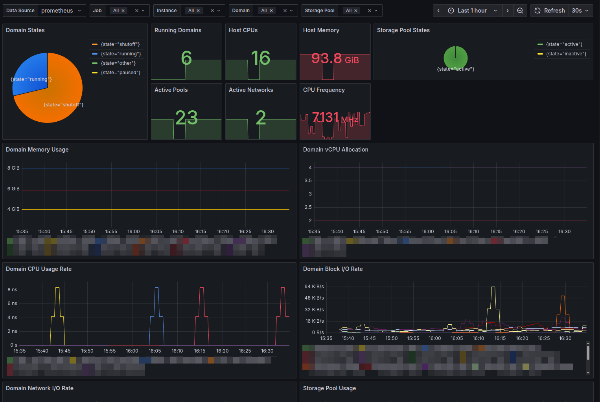

# Libvirt Prometheus Exporter

A lightweight, bash-based Prometheus exporter for libvirt hypervisor statistics. This exporter uses only bash, virsh, and socat to provide comprehensive virtualization metrics for monitoring with Prometheus and Grafana.

## Features

- **Pure Bash Implementation**: No external dependencies except `socat` and `virsh`
- **Comprehensive Metrics**: Exports all available libvirt statistics including:
  - Hypervisor information (CPU, memory, version)
  - Domain states, resource usage, and performance metrics
  - Virtual CPU, memory, disk, and network statistics per domain
  - Storage pool capacity, allocation, and availability
  - Virtual network states and configuration
  - Host NUMA memory information
- **HTTP Server**: Built-in HTTP server using socat for serving metrics
- **Systemd Integration**: Ready-to-use systemd service file
- **Multi-Instance Support**: Monitor multiple hypervisors
- **Resource Filtering**: Optional filtering of domains, pools, and networks
- **Grafana Dashboard**: Pre-built comprehensive dashboard

## Quick Start

### Prerequisites

- Libvirt hypervisor with virsh access
- `socat` package installed
- `virsh` command available
- `bc` command for calculations
- Prometheus server for scraping metrics

### Basic Installation

1. Clone the repository:
```bash
git clone https://github.com/itefixnet/prometheus-libvirt-exporter.git
cd prometheus-libvirt-exporter
```

2. Test the exporter:
```bash
./libvirt-exporter.sh test
```

3. Start the HTTP server:
```bash
./http-server.sh start
```

4. Access metrics at `http://localhost:9178/metrics`

### System Installation

For production deployment, install as a system service:

```bash
# Create user and directories
sudo useradd -r -s /bin/false -G libvirt libvirt-exporter
sudo mkdir -p /opt/libvirt-exporter

# Copy files
sudo cp *.sh /opt/libvirt-exporter/
sudo cp config.sh /opt/libvirt-exporter/
sudo cp libvirt-exporter.conf /opt/libvirt-exporter/
sudo cp libvirt-exporter.service /etc/systemd/system/

# Set permissions
sudo chown -R libvirt-exporter:libvirt /opt/libvirt-exporter
sudo chmod +x /opt/libvirt-exporter/*.sh

# Enable and start service
sudo systemctl daemon-reload
sudo systemctl enable libvirt-exporter
sudo systemctl start libvirt-exporter
```

## Configuration

### Environment Variables

The exporter can be configured using environment variables or configuration files:

| Variable | Default | Description |
|----------|---------|-------------|
| `VIRSH_COMMAND` | `virsh` | Path to virsh binary |
| `LIBVIRT_URI` | `qemu:///system` | Libvirt connection URI |
| `LISTEN_PORT` | `9178` | HTTP server port |
| `LISTEN_ADDRESS` | `0.0.0.0` | HTTP server bind address |
| `METRICS_PREFIX` | `libvirt` | Prometheus metrics prefix |
| `MAX_CONNECTIONS` | `10` | Maximum concurrent HTTP connections |
| `TIMEOUT` | `30` | Request timeout in seconds |

### Configuration Files

1. **`config.sh`**: Shell configuration file (sourced by scripts)
2. **`libvirt-exporter.conf`**: Systemd environment file

### Libvirt Configuration

The exporter requires access to libvirt via virsh. For local system access:

```bash
# Ensure user is in libvirt group
sudo usermod -a -G libvirt libvirt-exporter
```

For remote hypervisor monitoring, configure the URI:
```bash
# SSH connection
export LIBVIRT_URI="qemu+ssh://user@remote-host/system"

# TLS connection  
export LIBVIRT_URI="qemu+tls://remote-host/system"
```

## Metrics

The exporter provides the following comprehensive Prometheus metrics:

### Hypervisor Information
- `libvirt_hypervisor_libvirt_version` - Libvirt version (numeric)
- `libvirt_host_cpu_frequency_mhz` - Host CPU frequency in MHz
- `libvirt_host_cpu_total` - Total number of host CPUs
- `libvirt_host_cpu_sockets` - Number of CPU sockets
- `libvirt_host_cores_per_socket` - CPU cores per socket
- `libvirt_host_threads_per_core` - Threads per CPU core
- `libvirt_host_memory_total_bytes` - Total host memory in bytes

### Host Memory Usage
- `libvirt_host_memory_free_bytes{numa_node="N"}` - Free memory per NUMA node

### Domain Statistics
- `libvirt_domains_total{state="running|shutoff|paused|other"}` - Total domains by state
- `libvirt_domain_state{domain="name",state="state"}` - Individual domain states (1=active, 0=inactive)

### Domain Resource Usage
- `libvirt_domain_memory_max_bytes{domain="name"}` - Maximum memory for domain
- `libvirt_domain_memory_used_bytes{domain="name"}` - Used memory for domain
- `libvirt_domain_memory_actual_bytes{domain="name"}` - Actual memory used by domain
- `libvirt_domain_memory_available_bytes{domain="name"}` - Available memory for domain
- `libvirt_domain_memory_unused_bytes{domain="name"}` - Unused memory for domain
- `libvirt_domain_memory_rss_bytes{domain="name"}` - Resident set size for domain
- `libvirt_domain_vcpu_total{domain="name"}` - Number of virtual CPUs

### Domain Performance Metrics
- `libvirt_domain_cpu_time_seconds_total{domain="name"}` - Total CPU time used by domain (counter)
- `libvirt_domain_memory_swap_in_bytes{domain="name"}` - Memory swapped in for domain
- `libvirt_domain_memory_swap_out_bytes{domain="name"}` - Memory swapped out for domain
- `libvirt_domain_memory_major_faults_total{domain="name"}` - Major page faults (counter)
- `libvirt_domain_memory_minor_faults_total{domain="name"}` - Minor page faults (counter)

### Domain Block Device Statistics
- `libvirt_domain_block_read_requests_total{domain="name",device="device"}` - Block read requests (counter)
- `libvirt_domain_block_read_bytes_total{domain="name",device="device"}` - Bytes read from device (counter)
- `libvirt_domain_block_write_requests_total{domain="name",device="device"}` - Block write requests (counter)
- `libvirt_domain_block_write_bytes_total{domain="name",device="device"}` - Bytes written to device (counter)

### Domain Network Statistics
- `libvirt_domain_network_receive_bytes_total{domain="name",interface="iface"}` - Bytes received (counter)
- `libvirt_domain_network_receive_packets_total{domain="name",interface="iface"}` - Packets received (counter)
- `libvirt_domain_network_receive_errors_total{domain="name",interface="iface"}` - Receive errors (counter)
- `libvirt_domain_network_receive_drop_total{domain="name",interface="iface"}` - Receive drops (counter)
- `libvirt_domain_network_transmit_bytes_total{domain="name",interface="iface"}` - Bytes transmitted (counter)
- `libvirt_domain_network_transmit_packets_total{domain="name",interface="iface"}` - Packets transmitted (counter)
- `libvirt_domain_network_transmit_errors_total{domain="name",interface="iface"}` - Transmit errors (counter)
- `libvirt_domain_network_transmit_drop_total{domain="name",interface="iface"}` - Transmit drops (counter)

### Storage Pool Statistics
- `libvirt_pools_total{state="active|inactive"}` - Total storage pools by state (counter)
- `libvirt_pool_state{pool="name",state="state"}` - Storage pool states (1=active, 0=inactive)
- `libvirt_pool_autostart{pool="name"}` - Storage pool autostart setting (1=enabled, 0=disabled)
- `libvirt_pool_capacity_bytes{pool="name"}` - Storage pool capacity in bytes
- `libvirt_pool_allocation_bytes{pool="name"}` - Storage pool allocation in bytes
- `libvirt_pool_available_bytes{pool="name"}` - Storage pool available space in bytes

### Virtual Network Statistics
- `libvirt_networks_total{state="active|inactive"}` - Total virtual networks by state (counter)
- `libvirt_network_state{network="name",state="state"}` - Virtual network states (1=active, 0=inactive)
- `libvirt_network_autostart{network="name"}` - Virtual network autostart setting (1=enabled, 0=disabled)
- `libvirt_network_persistent{network="name"}` - Virtual network persistent setting (1=persistent, 0=transient)

## Usage Examples

### Manual Testing

```bash
# Test connection to libvirt
./libvirt-exporter.sh test

# Collect metrics once
./libvirt-exporter.sh collect

# Start HTTP server manually
./http-server.sh start

# Test HTTP endpoints
curl http://localhost:9178/metrics
curl http://localhost:9178/health
curl http://localhost:9178/
```

### Prometheus Configuration

Add jobs to your `prometheus.yml` for single or multiple hypervisors:

```yaml
scrape_configs:
  # Single hypervisor
  - job_name: 'libvirt-exporter'
    static_configs:
      - targets: ['localhost:9178']
    scrape_interval: 30s
    metrics_path: /metrics
    
  # Multiple hypervisors with labels
  - job_name: 'libvirt-hypervisors'
    static_configs:
      - targets: ['hypervisor1:9178', 'hypervisor2:9178']
        labels:
          environment: 'production'
          datacenter: 'dc1'
      - targets: ['dev-hypervisor:9178']
        labels:
          environment: 'development'
          datacenter: 'dc2'
    scrape_interval: 30s
    metrics_path: /metrics
```

### Grafana Dashboard

Import the provided `grafana-dashboard.json` file into your Grafana instance:

1. Go to Dashboards → Import
2. Upload `grafana-dashboard.json` or copy/paste the JSON content
3. **Configure Data Source**: Select your Prometheus datasource from the dropdown
4. Click "Import"

**Dashboard Features:**
The comprehensive Grafana dashboard includes:
- **Overview Panels**: Hypervisor status, domain counts, resource utilization
- **Host Metrics**: CPU, memory, and NUMA node information
- **Domain Monitoring**: Individual VM resource usage and performance
- **Storage Analytics**: Pool capacity, allocation, and availability tracking
- **Network Monitoring**: Virtual network status and domain network I/O
- **Performance Metrics**: CPU time, memory faults, disk and network throughput
- **Multi-Instance Support**: Template variables for filtering by hypervisor

**Multi-Instance Support:**
The dashboard includes template variables for monitoring multiple hypervisors:
- **Instance**: Filter by specific hypervisor (e.g., `hypervisor1:9178`, `localhost:9178`)
- **Job**: Filter by Prometheus job name
- **Domain**: Filter by specific virtual machine
- **Pool**: Filter by storage pool
- **Network**: Filter by virtual network

## Troubleshooting

### Common Issues

1. **Permission Denied**:
   - Ensure scripts are executable: `chmod +x *.sh`
   - Add user to libvirt group: `sudo usermod -a -G libvirt username`

2. **Cannot Connect to Libvirt**:
   - Verify libvirt is running: `systemctl status libvirtd`
   - Test manually: `virsh list --all`
   - Check URI configuration

3. **Port Already in Use**:
   - Change `LISTEN_PORT` in configuration
   - Check for other services: `netstat -tlnp | grep 9178`

4. **Missing Dependencies**:
   ```bash
   # Install socat (Ubuntu/Debian)
   sudo apt-get install socat bc
   
   # Install socat (CentOS/RHEL)
   sudo yum install socat bc
   
   # Install libvirt client tools
   sudo apt-get install libvirt-clients  # Ubuntu/Debian
   sudo yum install libvirt-client       # CentOS/RHEL
   ```

### Logging

- Service logs: `journalctl -u libvirt-exporter -f`
- Manual logs: Scripts output to stderr

### Performance Tuning

For hypervisors with many VMs:
- Increase `MAX_CONNECTIONS`
- Adjust `TIMEOUT` value
- Monitor system resources
- Consider filtering specific domains/pools/networks

## Development

### Testing

```bash
# Run basic tests
./libvirt-exporter.sh test
./http-server.sh test

# Test with different configurations
LIBVIRT_URI=qemu+ssh://user@remote-host/system ./libvirt-exporter.sh test
```

### Contributing

1. Fork the repository
2. Create a feature branch
3. Test thoroughly with various libvirt configurations
4. Submit a pull request

### License

This project is licensed under the BSD 2-Clause License - see the [LICENSE](LICENSE) file for details.

## Support

- GitHub Issues: [https://github.com/itefixnet/prometheus-libvirt-exporter/issues](https://github.com/itefixnet/prometheus-libvirt-exporter/issues)
- Documentation: This README and inline script comments

## Alternatives

This exporter focuses on simplicity and minimal dependencies. For more advanced features, consider:
- [libvirt_exporter](https://github.com/kumina/libvirt_exporter) (Go-based)
- [prometheus-libvirt-exporter](https://github.com/beyluta/prometheus-libvirt-exporter) (Python-based)
- Custom telegraf configurations
- Direct libvirt API integration
